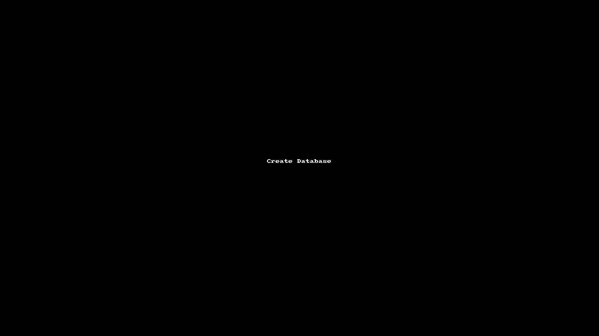
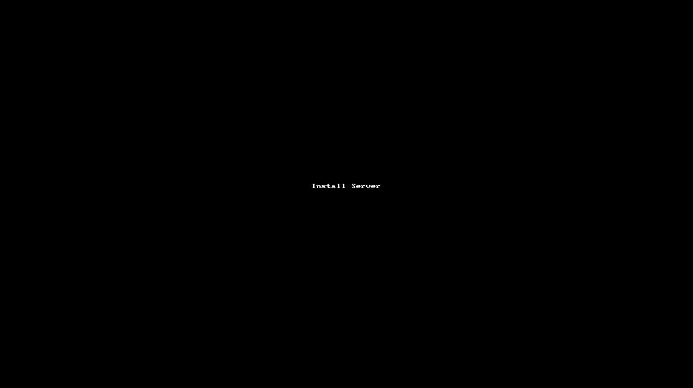

# App
 Projecto Open Source(Java Web) que implemeta as funcionalidades basicas de uma aplicação (Inserir, remover, editar e listar).

## Pré requisitos

- IDE(NetBeans ou outra)
- XAMPP 

> Ps. Neste projecto trabalhamos com NetBeans e os exemplos serão apresentandos usando o mesmo, porem podera o fazer usando qualquer IDE da tua preferencia.

## Instalação

Siga o procedimento padrão de instalação da IDE e o XAMPP.
Recomendo baixar a versão mais recente do XAMPP e da IDE selecionada, bem como ter o  [Git](https://git-scm.com/downloads) instalado na sua maquina.

## Clonando o Repositório ##

Com o Git instalado na sua maquina e a **URL** do projeto em mãos, cria em algum lugar do seu pc uma pasta para criarmos uma copia do repositório, dentro dela abra o **cmd** ou **powershell** e digite o comando abaixo:
```
git clone https://github.com/mariomthree/app.git
```
## Criar a base de dados

Crie a base de dados usando o **XAMPP**, abra o XAMPP inicie o Apache e MySQL.
Vai ao navegador e digite **http://localhost/phpmyadmin/** clique em novo e criar a base de dados com o nome **app**.

 

## Instalar o servidor na sua IDE(NetBeans)

Abra a sua IDE selecione em serviços de seguida em servidores, selecione o servidor **Apache TomCat or TomEE** procure na pasta de intalacao do servidor e adicione.

 

## Inicie a aplicação

Abra a aplicação na sua IDE, liga o **apache** o e **mysql** do XAMPP, faca o **deploy** da aplicação e  por fim execute.

 

